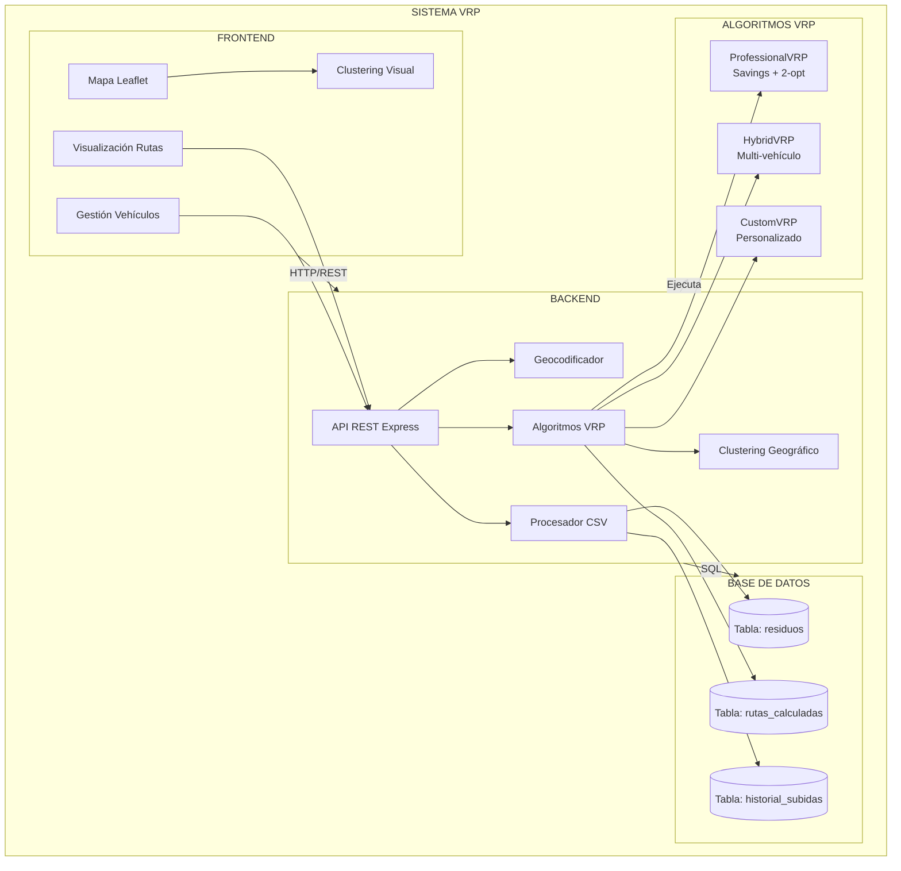
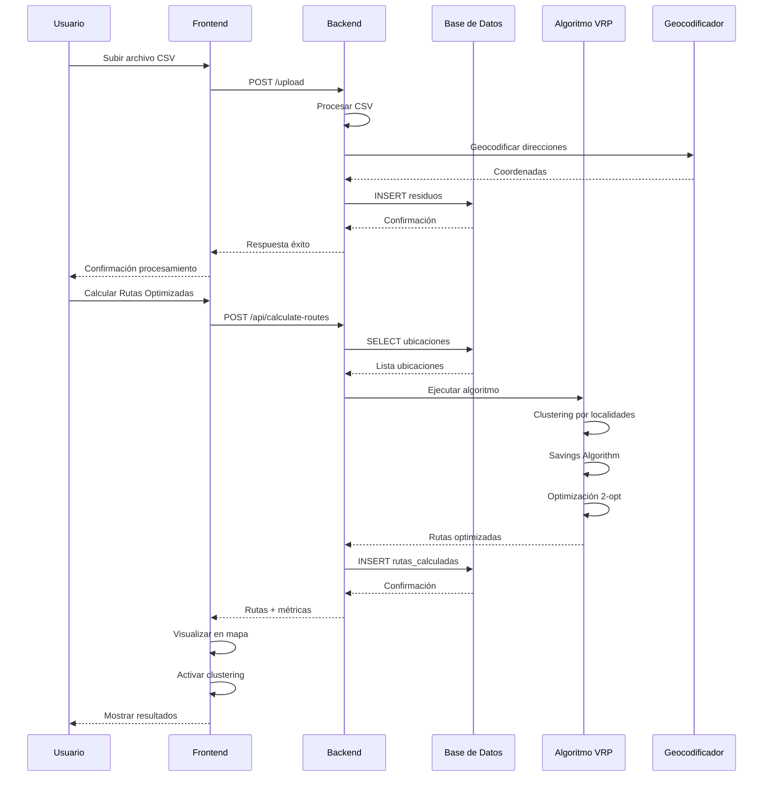
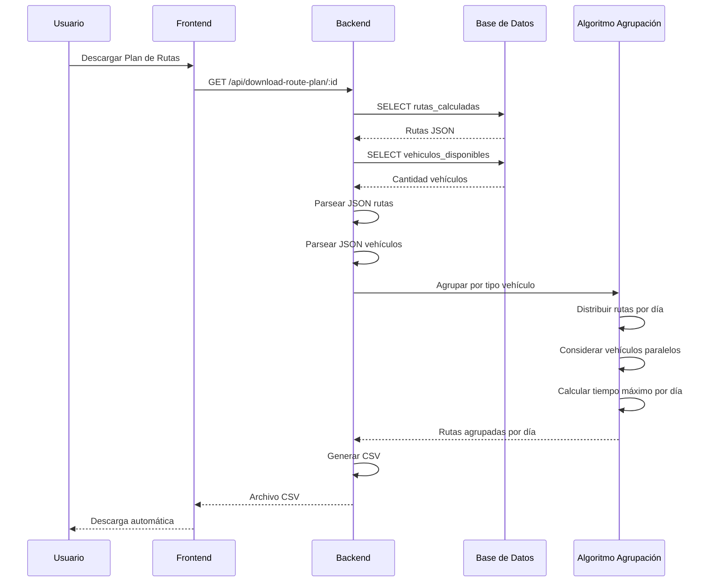
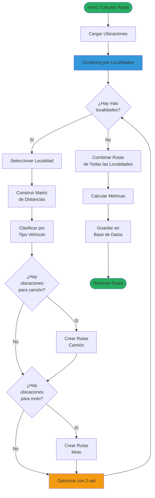
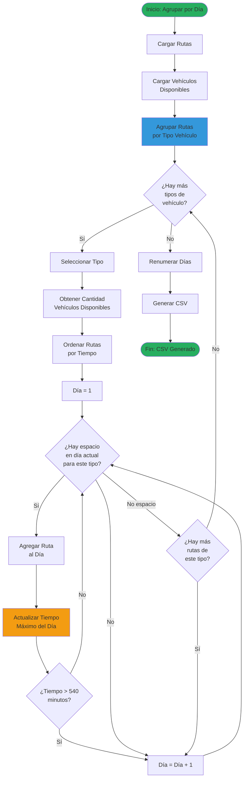
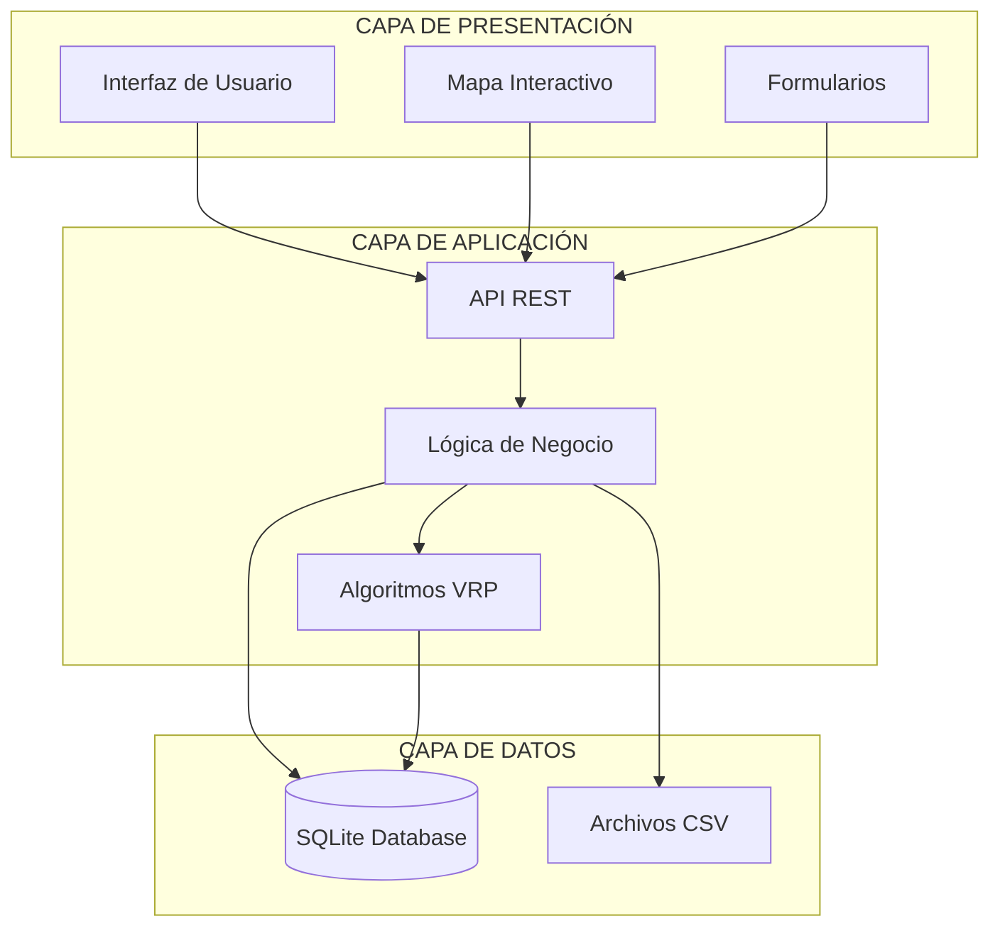
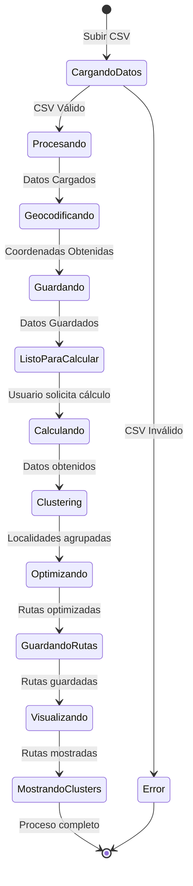
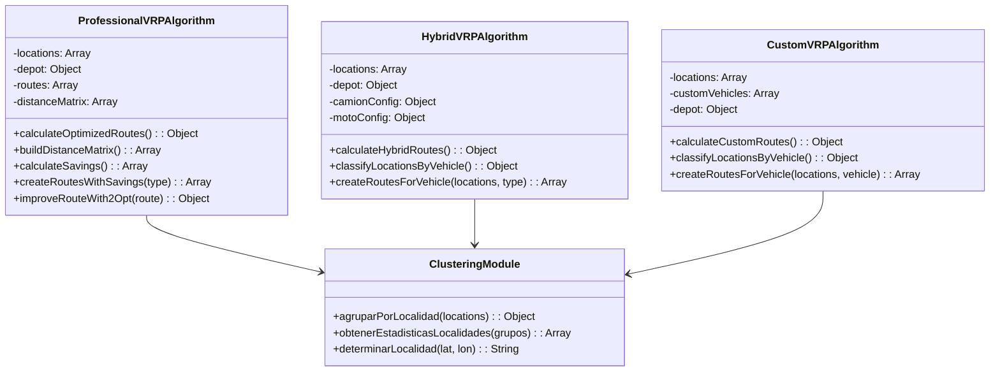

# DIAGRAMAS DEL SISTEMA VRP

Este documento contiene los diagramas del sistema en formato Mermaid, que pueden ser renderizados en GitHub, GitLab o convertidos a imágenes.

---

## DIAGRAMA DE COMPONENTES

---

## DIAGRAMA DE SECUENCIA: Carga de CSV y Cálculo de Rutas

---

## DIAGRAMA DE SECUENCIA: Agrupación por Día con Vehículos Paralelos

---

## DIAGRAMA DE FLUJO: Algoritmo VRP con Clustering

---

## DIAGRAMA DE FLUJO: Agrupación por Día

---

## DIAGRAMA DE ARQUITECTURA DE CAPAS

---

## DIAGRAMA DE ESTADOS: Proceso de Cálculo de Rutas

---

## DIAGRAMA DE CLASES (Simplificado)

---

## NOTAS SOBRE LOS DIAGRAMAS

### Cómo usar estos diagramas:

1. **En GitHub/GitLab:** Los diagramas Mermaid se renderizan automáticamente
2. **En Markdown:** Compatible con editores que soporten Mermaid
3. **Exportar a imagen:** Usar herramientas como:
   - Mermaid Live Editor: https://mermaid.live
   - VS Code con extensión Mermaid
   - Online tools de conversión

### Personalización:

Los diagramas pueden ser modificados editando el código Mermaid. Para más información sobre sintaxis Mermaid, consultar: https://mermaid.js.org

